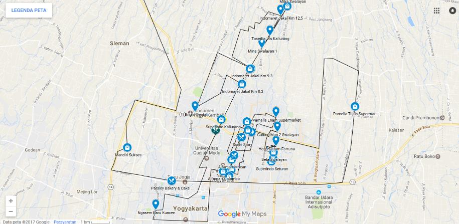
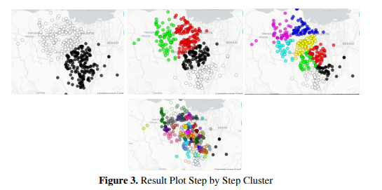
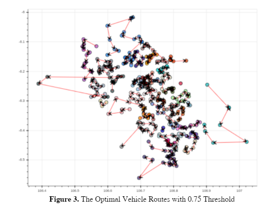
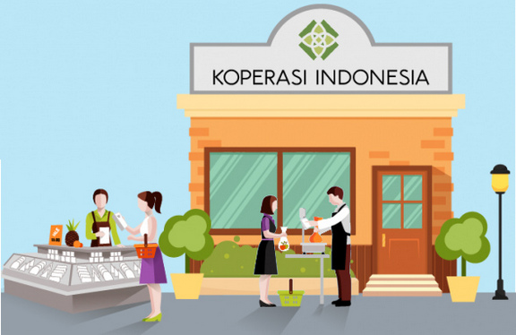

# I. Featured Projects
---
<!-- ## Natural Language Processing

### CS224n: Natural Language Processing with Deep Learning

My complete implementation of assignments and projects in [***CS224n: Natural Language Processing with Deep Learning***](http://web.stanford.edu/class/cs224n/) by Stanford (Winter, 2019).

**Neural Machine Translation:** An NMT system which translates texts from Spanish to English using a Bidirectional LSTM encoder for the source sentence and a Unidirectional LSTM Decoder with multiplicative attention for the target sentence ([GitHub](https://github.com/chriskhanhtran/CS224n-NLP-Solutions/tree/master/assignments/)).

**Dependency Parsing:** A Neural Transition-Based Dependency Parsing system with one-layer MLP ([GitHub](https://github.com/chriskhanhtran/CS224n-NLP-Assignments/tree/master/assignments/a3)).

---
### Detect Non-negative Airline Tweets: BERT for Sentiment Analysis

The release of Google's BERT is described as the beginning of a new era in NLP. In this notebook I'll use the HuggingFace's transformers library to fine-tune pretrained BERT model for a classification task. Then I will compare BERT's performance with a baseline model, in which I use a TF-IDF vectorizer and a Naive Bayes classifier. The transformers library helps us quickly and efficiently fine-tune the state-of-the-art BERT model and yield an accuracy rate 10% higher than the baseline model.

---
### Detect Food Trends from Facebook Posts: Co-occurence Matrix, Lift and PPMI

First I build co-occurence matrices of ingredients from Facebook posts from 2011 to 2015. Then, to identify interesting and rare ingredient combinations that occur more than by chance, I calculate Lift and PPMI metrics. Lastly, I plot time-series data of identified trends to validate my findings. Interesting food trends have emerged from this analysis.

 

  -->

---
### Optimize Route and Price

In this intern project, I analyze route for optimization minimum distance and price from outlet center to Yogyakarta outlet using Travelling Salesman Problem and then applied visualize in Google Maps to make it easier for drivers to determine the route based on the clusters (zona). Tools that I used was Microsoft Excel and R Programming (to visualize map), click on the badge.

 

 
 
 

---
# II. Research Projects (Publication)

---
### Optimizing Planning Service Territories by Dividing Into Compact Several Sub-areas Using Binary K-Means Clustering According Vehicle Constraints

This aim of the study was cast in the framework of determining the most effective way to deliver services from customer to other customers within a specified area, subject to limitations on resources such as service personnel and vehicle volume. Most of these algorithms employ a cluster-first and route-second strategy in order to address real application problems effectively.

 

 

---
### Set Best Threshold in Vehicle Routing Problem for Better Utilization

This aim of the study was set a minimum capacity threshold for each vehicle that is considered as well utilized before an order is assigned for the delivery process. So that vehicle is well utilized such that the cost of vehicle rent is also minimal.
 
In this case, we define a set of thresholds and then evaluate predicted probabilities under each to find and select the optimal threshold. The present paper focuses on the threshold selection in capacity vehicle routing problem. According to the comparison between 0.65 to 0.9 threshold, using OR-Tools CVRP we get the optimal threshold in 0.75. For future work, we need to analyze more and can implement on platforms with the real-time data shown in the maps. Another thing is for different data, it would be a different threshold that would optimize the result.

 

 

---
### Grouping of province in Indonesia based on the condition of the cooperative using K-Means Clustering

In 2017, I joined Hokkaido Indonesian Student Association Scientific Meeting was held in Sapporo, Japan. The main objective of this paper is to identify the potential of cooperatives in Indonesia based on conditions. The variables used in this study i.e. cooperatives are active, not active, the number of cooperative members, the annual Member meeting (RAT), manager, employee numbers, capital of its own, beyond the capital, volume of business and the rest of the business results (SHU). The analysis was done by k-means cluster approach and a diagram of the Spider Web. The results of this research show that the condition of cooperatives in Indonesia is divided into four groups. From the results of this research it is known that there is still very little regard for the province of existing variables.

 

 

---
## Arts by Me

<!--  -->

Besides Data Science, I also have a interest on arts and design like abstract paint or watercolor. Below is a list of my paints.

 

  
Untitled I

  
Untitled II

  
Untitled III

  

  
---

© 2022 Syarifah Rosita Dewi. Powered by Jekyll and the Minimal Theme.

